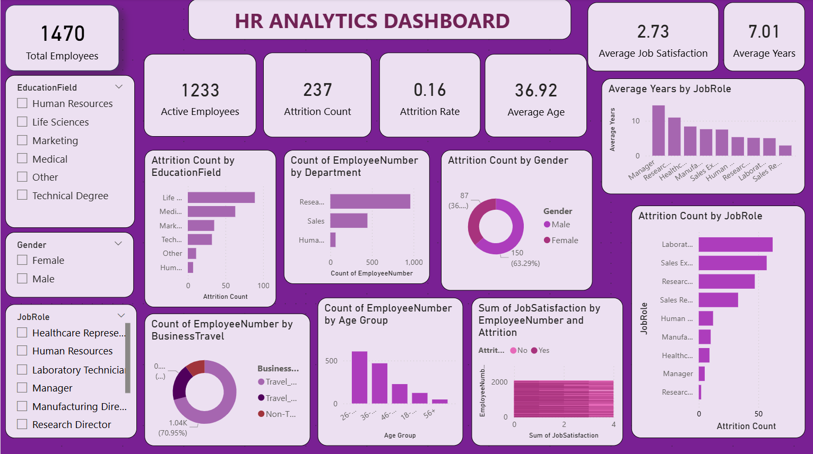

# 📊 HR Analytics Dashboard | Power BI

<p align="center">


</p>

---

# 📌 Project Overview

The **HR Analytics Dashboard** is an interactive Power BI project designed to analyze employee demographics, workforce trends, employee attrition, and departmental performance. It enables HR professionals and business leaders to make informed decisions using interactive reports and visualizations.

---

# 🖼️ Dashboard Preview

<p align="center">

</p>

---

# 🎯 Objectives

- Analyze employee attrition trends.
- Monitor workforce demographics.
- Compare employee distribution across departments.
- Identify high attrition job roles.
- Analyze employee age groups and gender distribution.
- Support HR decision-making using interactive visualizations.

---

# 📈 Key Performance Indicators (KPIs)

| KPI | Description |
|------|-------------|
| 👥 Total Employees | Total workforce |
| ✅ Active Employees | Employees currently working |
| ❌ Attrition Count | Employees who left the organization |
| 📉 Attrition Rate | Employee attrition percentage |
| 🎂 Average Age | Average employee age |
| 💰 Average Monthly Income | Average employee income |
| 📅 Average Years at Company | Employee experience |
| ⭐ Average Job Satisfaction | Employee satisfaction level |

---

# 📊 Dashboard Features

- 👥 Employee Overview
- 📉 Attrition Analysis
- 🏢 Department-wise Analysis
- 💼 Job Role Analysis
- 👨‍💼 Gender Distribution
- 🎓 Education Field Analysis
- ✈️ Business Travel Analysis
- 🎂 Age Group Analysis
- 📅 Years at Company Analysis
- 🎛️ Interactive Slicers and Filters

---

# 📂 Dataset

**Dataset:** IBM HR Analytics Employee Attrition & Performance

The dataset includes:

- Employee Number
- Age
- Gender
- Department
- Job Role
- Education Field
- Business Travel
- Marital Status
- Monthly Income
- Job Satisfaction
- Performance Rating
- Years at Company
- Attrition Status

---

# 🛠️ Tools & Technologies

| Tool | Purpose |
|------|---------|
| Microsoft Power BI Desktop | Dashboard Development |
| Power Query | Data Cleaning & Transformation |
| DAX | KPI Calculations |
| Microsoft Excel | Dataset |
| GitHub | Version Control & Portfolio |

---

# 💡 Business Insights

- Research & Development has the highest employee count.
- Employees aged **26–35** represent the largest workforce.
- Employees working overtime have a higher attrition rate.
- Sales and Laboratory Technician roles show relatively higher attrition.
- Workforce distribution varies across departments and job roles.

---

# 📁 Repository Structure

```text
HR-Analytics-Dashboard/
│
├── HR_Analytics_Dashboard.pbix
├── README.md
├── dashboard.png
├── LICENSE
└── WA_Fn-UseC_-HR-Employee-Attrition.xls
```

---

# 🚀 How to Use

1. Download or clone this repository.
2. Open **HR_Analytics_Dashboard.pbix** using Microsoft Power BI Desktop.
3. If prompted, connect the dataset.
4. Refresh the report.
5. Explore the interactive dashboard using the slicers and charts.

---

# 📚 Skills Demonstrated

- Data Cleaning
- Data Transformation
- Data Modeling
- DAX Calculations
- Power Query
- Dashboard Design
- Data Visualization
- HR Analytics
- Business Intelligence

---

# 📸 Dashboard Highlights

- 📊 Interactive KPI Cards
- 👥 Employee Overview
- 📉 Attrition Analysis
- 🏢 Department Analysis
- 💼 Job Role Analysis
- 👨‍💼 Gender Distribution
- 🎓 Education Field Analysis
- ✈️ Business Travel Analysis
- 🎂 Age Group Distribution
- 🎛️ Interactive Slicers

---

# 👩‍💻 Author

## Hemadharshini A

**Aspiring Data Analyst**

### Technical Skills

- 📊 Power BI
- 🗄️ SQL
- 🐍 Python
- 📈 Microsoft Excel
- 📉 Data Visualization
- ⚡ DAX
- 🔄 Power Query

---

# ⭐ Support

If you found this project helpful, please consider giving this repository a **⭐ Star**.

Thank you for visiting my project!
